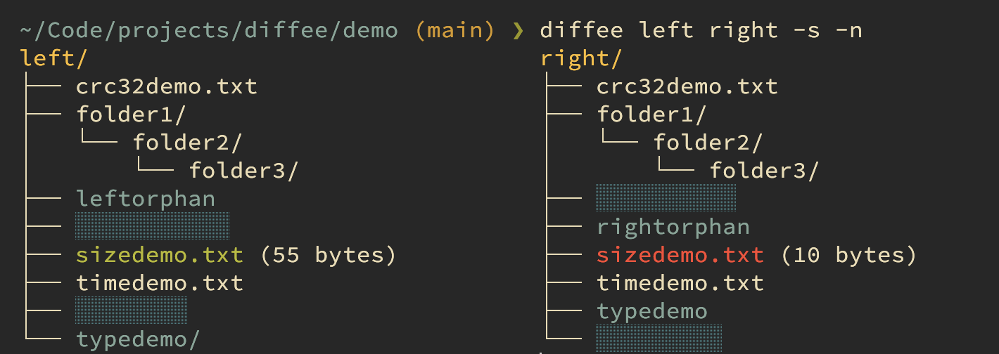

# diffee

`diffee` is a commandline folder comparison tool that offers a variety of outputs.

## Background

I'm very much used to `Beyond Compare 4` at work, but they didn't provide a proper version for macOS and I also need
something for the commandline. In the meantime `Beyond Compare 5` was released. I wasn't able to find a commandline tool
in my package manager to diff directories in a similar fashion. Then I searched on Github and there are many repos with
names like `cmpdir`, `dircmp` or any other combination with the words `[cmp|diff]+[dir(s)|folder(s)|tree(s)]`, but none
of them provides screenshots or a good description, and from what I can tell they are not doing what I need.
Therefore I created this tool with tools like
[`Beyond Compare`](https://www.scootersoftware.com),
[`icdiff`](https://github.com/jeffkaufman/icdiff),
[`diff -y`](https://www.gnu.org/software/diffutils/) and
[`tree`](https://github.com/Old-Man-Programmer/tree) in mind, hence the name `diffee`.

## Disclaimer

This is the first and probably last time I used the _Go_ language and I have no clue if I used it properly. The reason why I used it
instead of _C_ is because I wanted to use the _charmbracelet_ libs for colored output and rendering the directory trees.
Unfortunately _lipgloss/tree_ [has/had some bugs](https://github.com/charmbracelet/lipgloss/discussions/452),
so I decided to write my own tree renderer.

## Overview

By default `diffee` does a static side-by-side comparison with a colored tree view. But it also offers a plain format
(`--plain`) which is useful to pipe the text into the next command like _xargs_.

## Demo

https://github.com/user-attachments/assets/7fb36169-0d7e-4329-ad94-3ab7a75329d0

## Usage

    diffee [left_dir] <right_dir> [flags]

Compare `left_dir` to `right_dir`. If `left_dir` is omitted, the current working directory is used as `left_dir`.

## Options
### General

| Option         | Description                     |
|----------------|---------------------------------|
|`-h`/`--help`   | print help                      |
|`-v`/`--version`| print version                   |
|`-b`/`--bash`   | generate bash-completion script |

### Control Input

| Option                         | Description                                |
|--------------------------------|--------------------------------------------|
|`-a`/`--all`                    | don't ignore dotfiles                      |
|`-D`/`--depth`                  | limit depth, 0 is no limit and the default |
|`-I <regex>`/`--include <regex>`| include matching paths into diff can be used multiple times if `--include` and `--exclude` are used together then `--include` is applied first |
|`-E <regex>`/`--exclude <regex>`| exclude matching paths from diff can be used multiple times if `--include` and `--exclude` are used together then `--include` is applied first |

### Control Output

| Option               | Description                                      |
|----------------------|--------------------------------------------------|
|`-d`/`--diff`         | show only files that differ                      |
|`-m`/`--same`         | show only files that are the same                |
|`-f`/`--files`        | show only files                                  |
|`-F`/`--folders`      | show only folders                                |
|`-e`/`--no-empty`     | do not show empty folders                        |
|`-o`/`--orphans`      | show only orphans                                |
|`-O`/`--no-orphans`   | do not show orphans                              |
|`-l`/`--left-orphans` | show only left orphans                           |
|`-r`/`--right-orphans`| show only right orphans                          |
|`-p`/`--plain`        | print differences in plain format use `--single-quotes`/`-q` or `--double-quotes`/`-Q` to wrap in quotes useful in combination with _xargs_ |
|`-q`/`--single-quotes`| wrap plain output in single quotes               |
|`-Q`/`--double-quotes`| wrap plain output in double quotes               |

### Control Comparison

| Option       | Description               |
|--------------|---------------------------|
|`-s`/`--size` | compare file size         |
|`-t`/`--time` | compare modification time |
|`-c`/`--crc32`| compare CRC32 checksum    |

### Control Display

| Option             | Description                                        |
|--------------------|----------------------------------------------------|
|`-x`/`--swap`       | swap sides                                         |
|`-n`/`--info`       | print file diff info                               |
|`-C`/`--no-color`   | turn colored output off</b>overwrites `NO_COLOR`   |
|`-l`/`--left-alias` | display the given string as left root folder name  |
|`-r`/`--right-alias`| display the given string as right root folder name |

## Building `diffee`

    go build

## ToDo

### Improvements
- how to handle big depths that don't fit on screen?
- Maybe the performance can be improved by using multi-threading?

### Features
- config file and/or env vars for default flags and colors - only if user feedback demands it
- second `--all` or `--All/-A` to also not skip .git folders?
- `-I` like `--respect-vcs-ignore` (see fd / rg options)
- ignore casing on Windows if ever supported, highlight orange if different
- ignore casing `-i/-c`. (short option name already in use)
- create diff report (html, pdf)
- `--interactive/-i` interactive mode to bring it much closer to `Beyond Compare`.
    - has to use some kind of view/window in case the tree doesn't fit on its half side
	- copy
	- delete
	- exclude
	- orphans
	- non-orphans
	- open file diff view
	- compare to
	- set as root
	- navigate tree
	- open/close folders
	- swap sides
	- `--filediffcmd="icdiff {} {}"`  and/or config/env var

